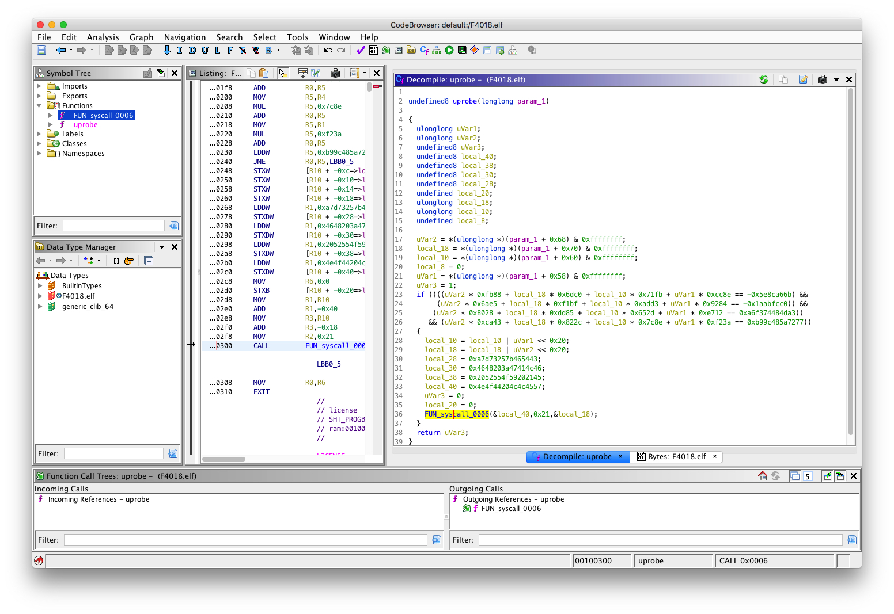

# RE | fpbe (87 solves)

## Description

Just a simple sudo program

[Attachment](to_player/fpbe)(sha1sum 95f8cef13f75e4f7b445e853df29f6bdbd189ec7)

## Solution

直接用ida打开可以发现是一个直接套了 [libbpf/libbpf-bootstrap](https://github.com/libbpf/libbpf-bootstrap) 模版的程序，逻辑必然在ebpf程序中。

通过对ebpf程序的简要了解可以得知ebpf字节码是直接嵌入到ELF文件中的，可以直接使用binwalk识别

```
→ binwalk -e fpbe

DECIMAL       HEXADECIMAL     DESCRIPTION
--------------------------------------------------------------------------------
0             0x0             ELF, 64-bit LSB executable, AMD x86-64, version 1 (GNU/Linux)
999448        0xF4018         ELF, 64-bit LSB relocatable, version 1 (SYSV)
...
```

在github上可搜到Ghidra对ebpf的支持插件 [Nalen98/eBPF-for-Ghidra](https://github.com/Nalen98/eBPF-for-Ghidra) 



打开可直接看到唯一的函数`uprobe`对flag的验证逻辑为一个四元四次方程组，解方程即可。

## Flag

`HFCTF{0vR3sAlbs8pD2h53}`

## Side Note

- fpbe是ebpf倒过来写
- `strings fpbe | grep /home`可以搜到出题人没去除干净的个人信息（用户名）